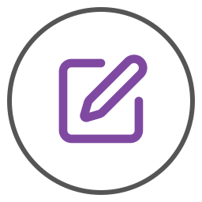

# Daily Memo (Alfred Workflow)

Quickly append time-stamped notes to a daily Markdown file. Ideal for rapid journaling or keeping a daily work log.

## 🚀 Features

- **Fast**: Just type `n` followed by your note.
- **Organized**: Automatically creates and appends to a file named `YYYYMMDD.md`.
- **Customizable**: Set your own save directory via Workflow Configuration.

## 📥 Installation

1. Download the latest `.alfredworkflow` file from the [Releases](https://github.com/mabutast/alfred-daily-memo/releases) page.
2. Double-click the file to install.

## 📖 Usage

1. Open Alfred and type `n`.
2. Enter your message (e.g., `n Started working on the project`).
3. Press **Enter** to save with a timestamp.

## ⚙️ Configuration

You can change the destination folder in Alfred's "Configure Workflow" menu:

- **`SAVE_PATH`**: The path to your memo folder. (Default: `~/Desktop`)

## 📄 License
MIT License
